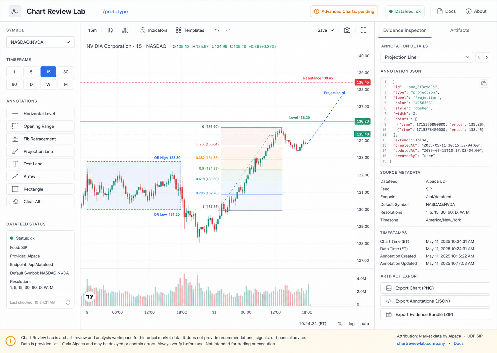

# Chart Review Lab Visual Brief

## Selected Direction

Evidence Bench is the selected visual direction for `/prototype` and `/widget-demo`.

Reference mock:

## Product Boundary

Chart Review Lab is a chart-review workspace for inspecting visual evidence and annotation artifacts. It is not a trading, brokerage, alerting, ranking, or recommendation product.

All prototype screens must avoid:

- recommendations, rankings, scores, signals, or alerts
- broker actions, orders, positions, portfolio state, execution, or P&L
- copy that implies financial advice
- copy that implies TradingView Advanced Charts approval is already granted
- private TradingView Advanced Charts library code

Keep data-source caveats and attribution visible where relevant.

## Layout

Use a calm three-zone workspace on desktop:

- left control rail for symbol, timeframe, annotation mode, and datafeed status
- central chart canvas for candles and deterministic annotation overlays
- right evidence inspector for selected annotation metadata, JSON, source caveats, and artifacts

For `/prototype`, prioritize the local chart renderer and Alpaca-backed datafeed. For `/widget-demo`, keep the same control/evidence language but make the fallback limitation explicit: TradingView widgets can display charts, but they do not provide programmable native drawing APIs.

## Visual Tone

The product should feel like a serious review bench: quiet, inspectable, and precise. Avoid decorative finance imagery, generic dark trading dashboards, oversized marketing hero composition, and flashy terminal styling.

Use grouping, spacing, separators, and typography before heavy borders or shadows. Cards should be limited to real panels or repeated artifacts, with small radii.

## Typography

- UI font: Inter or the system sans stack already used by the landing page.
- Body text: 14px to 16px.
- Panel headings: compact 15px to 18px.
- Route/page labels and status copy: 12px to 13px.
- JSON and endpoint values: monospace, 12px to 13px.
- Keep labels short and evidence text scannable.

## Color Roles

- Base: off-white page surface and white panels.
- Text: near-black slate for primary copy, muted slate for secondary copy.
- Lines: light blue-gray dividers and panel borders.
- Active controls: restrained blue.
- Datafeed ok: teal.
- Pending Advanced Charts state: amber.
- Boundary or caveat emphasis: red, used sparingly.

Do not make the interface a one-hue blue or purple dashboard.

## Component Patterns

Expected components:

- fixed or sticky top workspace bar with route, datafeed status, and pending Advanced Charts status
- symbol select for a small fixed symbol set
- timeframe segmented control
- annotation mode icon buttons for levels, range box, Fib-style references, projection, labels, inspect, and clear/remove
- deterministic annotation list with selected state
- evidence inspector with readable values and JSON
- artifact actions for screenshot, annotation JSON, and source summary
- compact caveat panel for data source, attribution, widget fallback, and pending approval state
- empty, loading, stale data, and datafeed error states

Controls should look usable and explicit, but they must not suggest scanning, ranking, alerting, or trade execution.

## Mobile Behavior

Use a single-column reading path:

1. workspace/status bar
2. chart controls
3. chart canvas
4. selected annotation evidence
5. annotation JSON and artifacts
6. caveats and attribution

The chart stays first and readable. The evidence inspector becomes a drawer or stacked section below the chart. Tool controls collapse into a compact toolbar. Caveats remain visible in the reading path rather than hidden behind hover-only UI.

## Implementation Notes For Follow-On Issues

- Issue #2 `/widget-demo`: match Evidence Bench tone and show the widget fallback limitation near the chart.
- Issue #3 `/prototype`: implement the full three-zone workspace, deterministic annotations, inspectable JSON, and mobile stacked path.
- Issue #4 Advanced Charts readiness: keep pending state honest and map annotation concepts to adapter contracts without private library assets.
- Issue #5 QA/handoff: test both desktop and mobile against this brief and verify safety-boundary copy.
